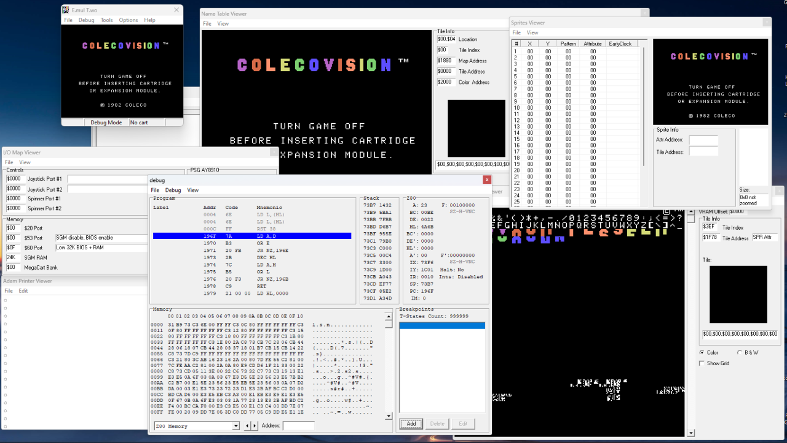

# emultwo
E.mul T.wo - A Colecovision and ADAM Emulator for Windows
The aim of this emulator is to help developers to make Colecovision games. 
The aim is not to add a great emulator to play colecovision games, but to help me and others debugging our code.

If you find a bug or want new features, you can help me [opening an issue](https://github.com/alekmaul/emultwo/issues).

This is an open source project.

_**Your Vision Is Our Vision...  COLECOVISION**_

----------

## Downloads

<a href="https://github.com/alekmaul/emultwo/releases/download/V1.0.0/emultwo_win32_1_0_0.zip</a>"> 

## Features

- Colecovision game support (.rom, .bin or .col files).
- Coleco ADAM game support (.ddp or .dsk files).
- Super Game Module support including AY sound chip.
- Megacart Bankswitching support (up to 512K).
- Full Controller button mapping.
- Save/Load Game State.
- Lots of viewers to track bugs in your developments.

## Features

- You need C++Builder 5.0 to build the project

## Todo

- F18A support.
- Super Action Controller, Spinner and Roller Controller (Trackball) mapping.

## Credits

- Thanks to wavemotion-dave, who improved a lot my DS version of the Coleco Emulator, memory management of this emulator is based on his version (https://github.com/wavemotion-dave/ColecoDS).

- Special thanks to  Marat Fayzullin, as the author of ColEM which is the code for the core emulation (https://fms.komkon.org/ColEm/).

- Great thanks to the authors of EightyOne, the skeleton of this emulator is based on it (https://sourceforge.net/projects/eightyone-sinclair-emulator/).  

## Support E.mul T.wo

E.mul T.wo is free but you can donate to support its development: 

## License

E.mul T.wo is licensed under the GNU General Public License v3.0 License, see [LICENSE](LICENSE) for more information.
